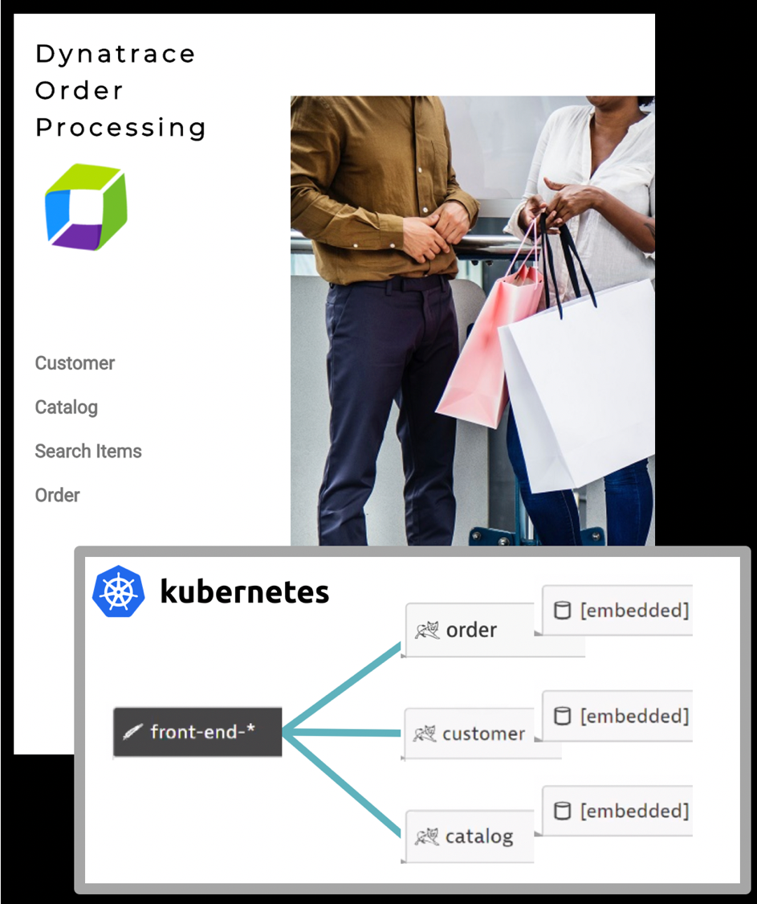
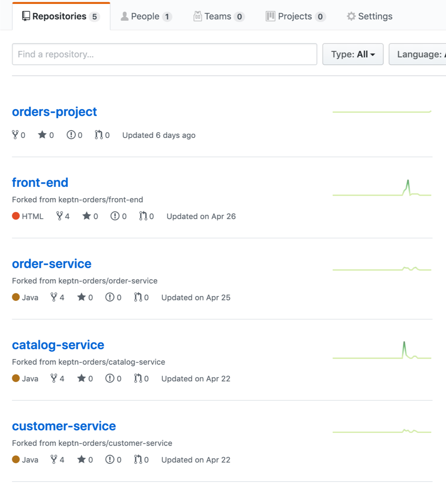
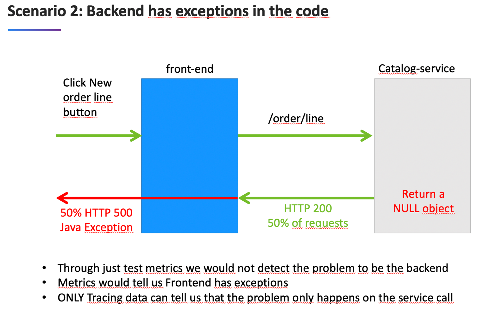
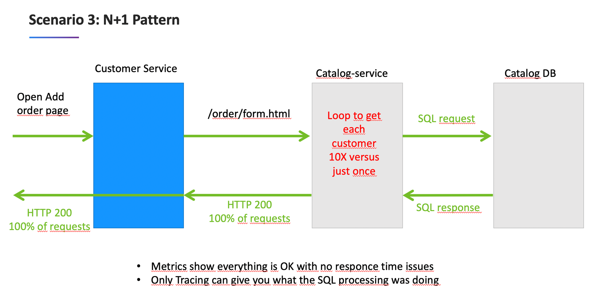

# Overview

This repos has the code and scripts to provision and configure a cloud infrastructure running Kubernetes and the [Keptn](http://keptn.sh) components to build, deploy and host a micro service based order processing demo application.



This demo uses a Keptn [Shipyard.yaml](keptn-onboarding/shipyard.yaml) file that will deploy the application to three environment: dev, staging, and production.

Once monitored by Dynatrace, a multi-tier call flow will be available such as shown below.


Other details:
* Built using [Keptn 0.3.0](https://keptn.sh/docs/0.3.0/installation/) 
* Currently, these setup scripts support only Google GKE and Azure AKS.  The plan is to then support RedHat, and Cloud Foundry PaaS platforms.
* Demo app based on example from: https://github.com/ewolff/microservice-kubernetes

# Pre-requisites

## 1. Accounts

1. Dynatrace - Assumes you will use a [trial SaaS dynatrace tenant](https://www.dynatrace.com/trial) and created a PaaS and API token.  See details in the [keptn docs](https://keptn.sh/docs/0.3.0/monitoring/dynatrace/)
1. GitHub - Assumes you have a github account and a personal access token with the persmissions keptn expects. See details in the [keptn docs](https://keptn.sh/docs/0.3.0/installation/setup-keptn-gke/)
1. Cloud provider account.  Highly recommend to sign up for personal free trial as to have full admin rights and to not cause any issues with your enterprise account. Links to free trials
   * [Google](https://cloud.google.com/free/)
   * [Azure](https://azure.microsoft.com/en-us/free/)

## 2. Github Org 

Create a github new github organization for the keptn-orders for Keptn to use and for the keptn-orders application repos to be forked.  See details in the [github docs](https://github.com/organizations/new)

Suggested gihub organization name: ```<your last name>-keptn-orders-gke``` or ```<your last name>-keptn-orders-aks```

NOTE: If the 'orders-project' repo already exists in your personal github org, there may be errors when you onboard again.  So delete the repo if it exists.

## 3. Tools

The following set of tools are required by the installation scripts and interacting with the environment.  The setup scripts will install these automatically on the bastion host, but below is a listing for refernce.

All platforms
* keptn -[Keptn CLI to manage Keptn projects](https://keptn.sh/docs/0.3.0/reference/cli/)
* jq - [Json query utility to suport parsing](https://stedolan.github.io/jq/)
* yq - [Yaml query utility to suport parsing](https://github.com/mikefarah/yq)
* hub - [git utility to support command line forking](https://github.com/github/hub)
* kubectl - [CLI to manage the cluster](https://kubernetes.io/docs/tasks/tools/install-kubectl). This is required for all, but will use the installation instructions per each cloud provider

Google additional tools
* gcloud - [CLI for Google Cloud](https://cloud.google.com/sdk/gcloud/)

Azure additional tools
* az - [CLI for Google Cloud](https://docs.microsoft.com/en-us/cli/azure/install-azure-cli?view=azure-cli-latest)

# Bastion host setup

See these instructions for provisioning an ubuntu 16.04 LTS host on the targeted cloud provider.  The setup scripts assume this version, so don't adjust this.
* [Google Compute Engine VM](GOOGLE.md)
* [Azure Compute Engine VM](AZURE.md)

# Provision Cluster, Install Keptn, and onboard the Orders application

There are multiple scripts used for the setup and they must be run the right order.  Just run the setup script that will prompt you with menu choices.
```
./setup.sh <deployment type>
```
NOTE: Valid 'deployment type' argument values are:
* gke = Google
* aks = Azure

The setup menu should look like this:
```
====================================================
SETUP MENU
====================================================
1)  Install Prerequisites Tools
2)  Enter Installation Script Inputs
3)  Provision Kubernetes cluster
4)  Install Keptn
5)  Install Dynatrace
6)  Fork keptn-orders Repos
7)  Onboard keptn-orders App to Keptn
----------------------------------------------------
10)  Validate Kubectl
11)  Validate Prerequisite Tools
----------------------------------------------------
99) Delete Kubernetes cluster
====================================================
Please enter your choice or <q> or <return> to exit

```

NOTE: each script will log the console output into the ```logs/``` subfolder.


## 1) Install Prerequisites Tools

This will install the required unix tools such as kubectl, jq, cloud provider CLI.

At the end if the installation, the script will 
* call the 'Validate Prerequisite Tools' script that will verify tools setup setup
* call the cloud provider CLI configure command that will prompt you for account and default values

NOTE: You can re-run both 'Install Prerequisites Tools' or 'Validate Prerequisite Tools' anytime as required.

## 2) Enter Installation Script Inputs

Before you do this step, be prepared with your github credentials, dynatrace tokens, and cloud provider project information available.

This will prompt you for values that are referenced in the remaining setup scripts. Inputted values are stored in ```creds.json``` file. For example on GKE the menus looks like:

```
===================================================================
Please enter the values for provider type: Google GKE:
===================================================================
Dynatrace Host Name (e.g. abc12345.live.dynatrace.com)
                                       (current: DYNATRACE_HOSTNAME_PLACEHOLDER) : 
Dynatrace API Token                    (current: DYNATRACE_API_TOKEN_PLACEHOLDER) : 
Dynatrace PaaS Token                   (current: DYNATRACE_PAAS_TOKEN_PLACEHOLDER) : 
GitHub User Name                       (current: GITHUB_USER_NAME_PLACEHOLDER) : 
GitHub Personal Access Token           (current: PERSONAL_ACCESS_TOKEN_PLACEHOLDER) : 
GitHub User Email                      (current: GITHUB_USER_EMAIL_PLACEHOLDER) : 
GitHub Organization                    (current: GITHUB_ORG_PLACEHOLDER) : 
Google Project                         (current: GKE_PROJECT_PLACEHOLDER) : 
Cluster Name                           (current: CLUSTER_NAME_PLACEHOLDER) : 
Cluster Zone (eg.us-east1-b)           (current: CLUSTER_ZONE_PLACEHOLDER) : 
Cluster Region (eg.us-east1)           (current: CLUSTER_REGION_PLACEHOLDER) :
```

## 3) Provision Kubernetes cluster

This will provision a Cluster on the specified cloud deployment type using the platforms CLI. This script will take several minutes to run and you can verify the cluster was created with the the cloud provider console.

The cluster will take 5-10 minutes to provision.

This script at the end will run the 'Validate Kubectl' script.  

## 4) Install Keptn

This will install the Keptn control plane components into your cluster.  The install will take 5-10 minutes to perform.

NOTE: Internally, this script will perform the following:
1. clone https://github.com/keptn/installer.  This repo has the cred.sav templates for building a creds.json file that the keptn CLI can use as an argument
1. use the values we already captured in the ```2-enterInstallationScriptInputs.sh``` script to create the creds.json file
1. run the ```keptn install -c=creds.json --platform=<Cluster>``` 
1. run the 'Show Keptn' helper script

## 5) Install Dynatrace

This will install the Dynatrace OneAgent Operator into your cluster.  The install will take 3-5 minutes to perform.

NOTE: Internally, this script will perform the following:
1. clone https://github.com/keptn/dynatrace-service.  This repo has scripts for each platform to install the Dyntrace OneAgent Operator and the cred_dt.sav template for building a creds_dt.json file that the install script expects to read
1. use the values we already captured in the ```2-enterInstallationScriptInputs.sh``` script to create the creds_dt.json file
1. run the ```/deploy/scripts/deployDynatraceOn<Platform>.sh``` script in the dynatrace-service folder
1. run the 'Show Dynatrace' helper script

## 6) Fork keptn-orders application repositories

This will fork the keptn-orders application into the github organization you specified when you called 'Enter Installation Script Inputs' step.  

Internally, this script will:
1. delete and created a local respositories/ folder
1. clone the orders application repositories
1. use the ```hub``` unix git utility to fork each repositories
1. push each keptn-orders repositories to your personal github organization

## 7) Onboard keptn-orders application

This script will onboard the orders application using the ```keptn``` CLI tool and the keptn onboarding files found in the ```keptn-onboarding/``` folder.  

Internally, this script will:
* keptn create project
* keptn onboard service

You can verify the onbaording was complete by reviewing the 'orders-project' within your personal git org.



# Other setup related scripts

These are additional scripts available in the 'setup.sh' menu.

## 10)  Validate Kubectl

This script will attempt to 'get pods' using kubectl. 

## 11)  Validate Prerequisite Tools

This script will look for the existence of required prerequisite tools.  It does NOT check for version just the existence of the script. 

## 99) Delete Kubernetes cluster

Fastest way to remove everything is to delete your cluster using this script.  Becare when you run this as to not lose your work.

# Deploy the application

Keptn deployment start with a "new-artifact" event. Below are the commands that can be run from the bastion host for each service.

```
keptn send event new-artifact --project=orders-project --service=order-service --image=robjahn/keptn-orders-order-service --tag=1
keptn send event new-artifact --project=orders-project --service=catalog-service --image=robjahn/keptn-orders-catalog-service --tag=1
keptn send event new-artifact --project=orders-project --service=customer-service --image=robjahn/keptn-orders-customer-service --tag=1
keptn send event new-artifact --project=orders-project --service=front-end --image=robjahn/keptn-orders-front-end --tag=1
```

Once the events are run, you can:
* monitor the jobs within Jenkins. Using the ```./helper.sh``` script, pick 'show jenkins' option to get the URL to Jenkins.
* get the pod status and the URLs to the application by using the ```./helper.sh``` script and picking the 'show app' option.

# Helpful scripts

These scripts are helpful when using and reviewing status of your environment.  Just run the helper script that will prompt you with menu choices.
```
./helper.sh
```

The helper menu should look like this:
```
====================================================
HELPER MENU
====================================================
1) show App
2) show Keptn
3) show Dynatrace
====================================================
Please enter your choice or <q> or <return> to exit

```

NOTE: each script will log the console output into the ```logs/``` subfolder.

## 1) Show app

Displays the deployed orders application pods and urls to access the application

## 2) Show Keptn

Displays the Keptn pods and ingress gateway

## 3) Show Dyntrace

Displays the Dynatrace pods 

# Pre-built Docker Images

The keptn-orders application has pre-built problems programmed within different versions.  See source in the [keptn-orders repo](https://github.com/keptn-orders).  Each version for each service, has pre-built docker images that are published to [docker hub](https://hub.docker.com/u/robjahn).

This is a summary of the versions followed by a description of the problem scenarios.

| Service  | Branch/Docker Tag | Description |
|---|:---:|---|
| front-end | 1 | Normal behavior |
| catalog-service | 1 | Normal behavior |
| customer-service | 1 | Normal behavior |
| order-service | 1 | Normal behavior |
| customer-service | 2 | High Response time for /customer/list.html |
| order-service | 2 | 50% exception for /order/line URL and n+1 back-end calls for /order/form.html |

# Problem Scenarios

## Use customer-service Tag 2 
```
# use the keptn cli to deploy new image

keptn send event new-artifact --project=orders-project --service=customer-service --image=robjahn/keptn-orders-customer-service --tag=2
```


## Use customer-order Tag 2 
```
# use the keptn cli to deploy new image

keptn send event new-artifact --project=orders-project --service=order-service --image=robjahn/keptn-orders-order-service --tag=2
```


## Use customer-order Tag 2 
```
# use the keptn cli to deploy new image

keptn send event new-artifact --project=orders-project --service=order-service --image=robjahn/keptn-orders-order-service --tag=2
```


