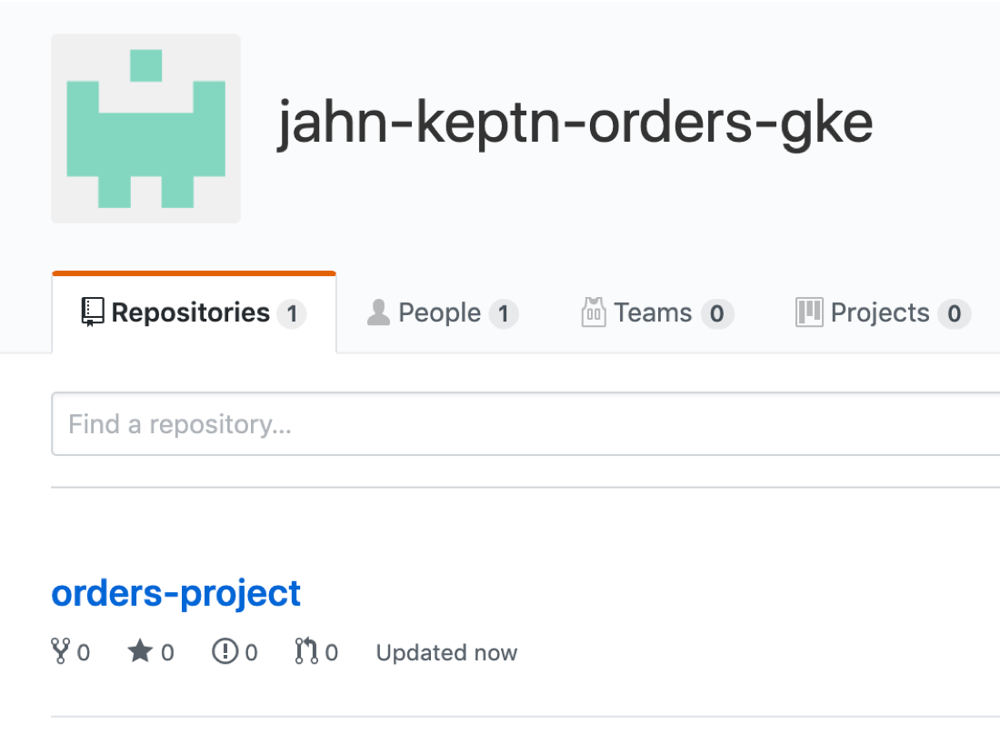

# Overview

This repo has the scripts to provision and configure a Kubernetes cloud infrastructure and install [Keptn](http://keptn.sh), the open-source framework for event-based, automated continuous operations, as well as onboarding a micro service based order processing demo application into Keptn.  The other repos in this GitHub organization contain the demo application source code.  The purpose of this effort is for demonstrations of the Keptn platfor on various Kubernetes platforms.

Currently, Keptn 0.4.0 and these keptn-orders-setup scripts support only Google GKE and Azure AKS.  

Branches within this repo are keep in sync with Keptn releases. Master branch is the latest fully regression tested.  **This branch tested for [Keptn 0.4.0](https://keptn.sh/docs/0.4.0/installation/)**

This Demo is maintained by rob.jahn@dynatrace.com.  If you have questions or feedback, you can reach out to me.

Watch a video demo of the install and onboarding of Keptn Orders demo app on Amazon AKS - [part1]( https://www.youtube.com/watch?v=vF8pXs2qiYU) and [Part two](https://www.youtube.com/watch?v=SZe1T4XSeSQ)

Much of this same information is in this readme, but here are two blogs that give an overivew the setup.
* [On-boarding your custom application to Keptn on AKS — Part 1 of 2](https://medium.com/keptn/on-boarding-your-custom-application-to-keptn-on-gke-part-1-of-2-e18817205e4a)
* [On-boarding your custom application to Keptn on AKS — Part 1 of 2](https://medium.com/keptn/on-boarding-your-custom-application-to-keptn-on-aks-part-1-of-2-fc15bb7d2a95)
* [On-boarding your custom application to Keptn— Part 2 of 2](https://medium.com/keptn/on-boarding-your-custom-application-to-keptn-part-2-of-2-56c6ec0bdcd5)

# Demo Application

There are 4 components, a front-end and 3 backend services.  The front-end look like this.


Once monitored by Dynatrace, a multi-tier call flow will be available such as shown below.


Other details:
* This demo uses a Keptn [Shipyard.yaml](keptn-onboarding/shipyard.yaml) file that will deploy the application to three environment: dev, staging, and production.
* Demo app based on example from: https://github.com/ewolff/microservice-kubernetes

Setup and Usage Table of Contents
=================

   * [Pre-requisites](#pre-requisites)
      * [1. Accounts](#1-accounts)
      * [2. Github Org](#2-github-org)
      * [3. Tools](#3-tools)
   * [Bastion host setup](#bastion-host-setup)
   * [Provision Cluster, Install Keptn, and onboard the Orders application](#provision-cluster-install-keptn-and-onboard-the-orders-application)
     * [Installation scripts from setup menu](#installation-scripts-from-setup-menu)
        * [1) Install Prerequisites Tools](#1-install-prerequisites-tools)
        * [2) Enter Installation Script Inputs](#2-enter-installation-script-inputs)
        * [3) Provision Kubernetes cluster](#3-provision-kubernetes-cluster)
        * [4) Install Keptn](#4-install-keptn)
        * [5) Install Dynatrace](#5-install-dynatrace)
        * [6) Fork keptn-orders application repositories](#6-fork-keptn-orders-application-repositories)
        * [7) Onboard keptn-orders application](#7-onboard-keptn-orders-application)
     * [Validation Scripts from setup menu](#validation-scripts-from-setup-menu)
        * [8)  Setup HA Proxy to Keptn Bridge](#8--setup-ha-proxy-to-keptn-bridge)
        * [10)  Validate Kubectl](#10--validate-kubectl)
        * [11)  Validate Prerequisite Tools](#11--validate-prerequisite-tools)
     * [Helper scripts from setup menu](#helper-scripts-from-setup-menu)
        * [20) Show app](#20-show-app)
        * [21) Show Keptn](#21-show-keptn)
        * [22) Show Dyntrace](#22-show-dyntrace)
        * [30) Send Keptn Artifact Events](#30-send-keptn-artifact-events)
     * [Delete Kubernetes cluster from setup menu](#delete-kubernetes-cluster-from-setup-menu)
   * [Pre-built Docker Images](#pre-built-docker-images)
   * [Problem Scenarios](#problem-scenarios)
      * [Use customer-service Tag 2](#use-customer-service-tag-2)
      * [Use order-service Tag 2](#use-order-service-tag-2)

Table of Contents generated by this utility https://github.com/ekalinin/github-markdown-toc
```
docker run -it vemonet/markdown-toc-generator https://github.com/keptn-orders/keptn-orders-setup/blob/master/README.md
```

# Pre-requisites

## 1. Accounts

1. Dynatrace - Assumes you will use a [trial SaaS dynatrace tenant](https://www.dynatrace.com/trial) and created a PaaS and API token.  See details in the [keptn docs](https://keptn.sh/docs/0.4.0/monitoring/dynatrace/)
1. GitHub - Assumes you have a github account and a personal access token with the persmissions keptn expects. See details in the [keptn docs](https://keptn.sh/docs/0.4.0/installation/setup-keptn/)
1. Cloud provider account.  Highly recommend to sign up for personal free trial as to have full admin rights and to not cause any issues with your enterprise account. Links to free trials
   * [Google](https://cloud.google.com/free/)
   * [Azure](https://azure.microsoft.com/en-us/free/)

## 2. Github Org

Keptn expects all the code repos and project files to be in the same GitHub Organization. So create a github new github organization for the keptn-orders for Keptn to use and for the keptn-orders application repos to be forked.  See details in the [github docs](https://github.com/organizations/new)

Suggested gihub organization name: ```<your last name>-keptn-orders-<cloud provider>``` for examaple ```jahn-keptn-orders-aks```

NOTE: If the 'orders-project' repo already exists in your personal github org, there may be errors when you onboard again.  So delete the repo if it exists.

## 3. Tools

The following set of tools are required by the installation scripts and interacting with the environment.  The setup scripts will install these automatically on the bastion host, but below is a listing for reference.

All platforms
* keptn -[Keptn CLI to manage Keptn projects](https://keptn.sh/docs/0.4.0/reference/cli/)
* jq - [Json query utility to suport parsing](https://stedolan.github.io/jq/)
* yq - [Yaml query utility to suport parsing](https://github.com/mikefarah/yq)
* hub - [git utility to support command line forking](https://github.com/github/hub)
* kubectl - [CLI to manage the cluster](https://kubernetes.io/docs/tasks/tools/install-kubectl). This is required for all, but will use the installation instructions per each cloud provider
* bc - [basic calculator utility using during validation within dynatrace install script](https://www.geeksforgeeks.org/bc-command-linux-examples/)

Google additional tools
* gcloud - [CLI for Google Cloud](https://cloud.google.com/sdk/gcloud/)

Azure additional tools
* az - [CLI for Google Cloud](https://docs.microsoft.com/en-us/cli/azure/install-azure-cli?view=azure-cli-latest)

Amazon additional tools
* ekscli - [CLI Provisioning EKS cluster](https://github.com/weaveworks/eksctl)

# Bastion host setup

See these instructions for provisioning an ubuntu 16.04 LTS host on the targeted cloud provider.  The setup scripts assume this version, so don't adjust this.
* [Google Compute Engine VM](GOOGLE.md)
* [Azure Compute Engine VM](AZURE.md)

# Provision Cluster, Install Keptn, and onboard the Orders application

There are multiple scripts used for the setup and they must be run the right order.  Just run the setup script that will prompt you with menu choices.
```
./setup.sh <deployment type>
```
NOTE: Valid 'deployment type' argument values are:
* gke = Google
* aks = Azure
* eks = Amazon

The setup menu should look like this:
```
====================================================
SETUP MENU
====================================================
1)  Install Prerequisites Tools
2)  Enter Installation Script Inputs
3)  Provision Kubernetes cluster
4)  Install Keptn
5)  Install Dynatrace
6)  Fork keptn-orders Repos
7)  Onboard keptn-orders App to Keptn
8)  Setup HA Proxy to Keptn Bridge
----------------------------------------------------
10) Validate Kubectl
11) Validate Prerequisite Tools
----------------------------------------------------
20) Show Orders App
21) Show Keptn
22) Show Dynatrace
----------------------------------------------------
30) Send Keptn Artifact Events
----------------------------------------------------
99) Delete Kubernetes cluster
====================================================
Please enter your choice or <q> or <return> to exit

```

NOTE: each script will log the console output into the ```logs/``` subfolder.

## 1) Install Prerequisites Tools

This will install the required unix tools such as kubectl, jq, cloud provider CLI.

At the end if the installation, the script will 
* call the 'Validate Prerequisite Tools' script that will verify tools setup setup
* call the cloud provider CLI configure command that will prompt you for account and default values

NOTE: You can re-run both 'Install Prerequisites Tools' or 'Validate Prerequisite Tools' anytime as required.

## 2) Enter Installation Script Inputs

Before you do this step, be prepared with your github credentials, dynatrace tokens, and cloud provider project information available.

This will prompt you for values that are referenced in the remaining setup scripts. Inputted values are stored in ```creds.json``` file. For example on GKE the menus looks like:

```
===================================================================
Please enter the values for provider type: Google GKE:
===================================================================
Dynatrace Host Name (e.g. abc12345.live.dynatrace.com)
                                       (current: DYNATRACE_HOSTNAME_PLACEHOLDER) : 
Dynatrace API Token                    (current: DYNATRACE_API_TOKEN_PLACEHOLDER) : 
Dynatrace PaaS Token                   (current: DYNATRACE_PAAS_TOKEN_PLACEHOLDER) : 
GitHub User Name                       (current: GITHUB_USER_NAME_PLACEHOLDER) : 
GitHub Personal Access Token           (current: PERSONAL_ACCESS_TOKEN_PLACEHOLDER) : 
GitHub User Email                      (current: GITHUB_USER_EMAIL_PLACEHOLDER) : 
GitHub Organization                    (current: GITHUB_ORG_PLACEHOLDER) : 
Google Project                         (current: GKE_PROJECT_PLACEHOLDER) : 
Cluster Name                           (current: CLUSTER_NAME_PLACEHOLDER) : 
Cluster Zone (eg.us-east1-b)           (current: CLUSTER_ZONE_PLACEHOLDER) : 
Cluster Region (eg.us-east1)           (current: CLUSTER_REGION_PLACEHOLDER) :
```

## 3) Provision Kubernetes cluster

This will provision a Cluster on the specified cloud deployment type using the platforms CLI. This script will take several minutes to run and you can verify the cluster was created with the the cloud provider console.

The cluster will take 5-10 minutes to provision.

This script at the end will run the 'Validate Kubectl' script.  

## 4) Install Keptn

This will install the Keptn control plane components into your cluster.  The install will take 5-10 minutes to perform.

NOTE: Internally, this script will perform the following:
1. clone https://github.com/keptn/installer.  This repo has the cred.sav templates for building a creds.json file that the keptn CLI can use as an argument
1. use the values we already captured in the ```2-enterInstallationScriptInputs.sh``` script to create the creds.json file
1. run the ```keptn install -c=creds.json --platform=<Cluster>``` 
1. run the 'Show Keptn' helper script

## 5) Install Dynatrace

This will install the Dynatrace OneAgent Operator into your cluster.  The install will take 3-5 minutes to perform.

NOTE: Internally, this script will perform the following:
1. clone https://github.com/keptn/dynatrace-service.  This repo has scripts for each platform to install the Dyntrace OneAgent Operator and the cred_dt.sav template for building a creds_dt.json file that the install script expects to read
1. use the values we already captured in the ```2-enterInstallationScriptInputs.sh``` script to create the creds_dt.json file
1. run the ```/deploy/scripts/deployDynatraceOn<Platform>.sh``` script in the dynatrace-service folder
1. run the 'Show Dynatrace' helper script

## 6) Fork keptn-orders application repositories

This will fork the keptn-orders application into the github organization you specified when you called 'Enter Installation Script Inputs' step.  

Internally, this script will:
1. delete and created a local respositories/ folder
1. clone the orders application repositories
1. use the ```hub``` unix git utility to fork each repositories
1. push each keptn-orders repositories to your personal github organization

## 7) Onboard keptn-orders application

This script will onboard the orders application using the ```keptn``` CLI tool and the keptn onboarding files found in the ```keptn-onboarding/``` folder.  

Internally, this script will:
* keptn create project
* keptn onboard service

You can verify the onbaording was complete by reviewing the 'orders-project' within your personal git org.



# Validation Scripts from setup menu

## 8)  Setup HA Proxy to Keptn Bridge

The [keptn’s bridge](https://keptn.sh/docs/0.4.0/reference/keptnsbridge/) provides an easy way to browse all events that are sent within keptn and to filter on a specific keptn context. When you access the keptn’s bridge, all keptn entry points will be listed in the left column. Please note that this list only represents the start of a deployment of a new artifact and, thus, more information on the executed steps can be revealed when you click on one event.


The keptn’s bridge is not publicly accessible, but can be retrieved using kubernetes port-forwarding using the ```kubectl port-forward``` command.  This script will install haproxy service on the bastion host, configure it with basic authentication, listen on port 80 and forward it to kubernetes listening on port 9000.

The script will output the ```kubectl port-forward``` command to run as well as the URL to open in a browser to view the Keptn Bridge.  I recommend making a second terminal window since the command runs in a continuous loop.a

Sample output:

```
======================================================================
Creating new /etc/haproxy/haproxy.cfg
Restarting haproxy

======================================================================
Start Keptn Bridge with this command:
while true; do kubectl port-forward svc/bridge -n keptn 9000:8080; done

View bridge @ http://123.123.123.123/#/
```

Recommend using a seperate SSH terminal session since the ```kubectl port-forward``` remains running.

## 10)  Validate Kubectl

This script will attempt to 'get pods' using kubectl. 

## 11)  Validate Prerequisite Tools

This script will look for the existence of required prerequisite tools.  It does NOT check for version just the existence of the script. 

# Helper scripts from setup menu

These scripts are helpful when using and reviewing status of your environment.  Just run the helper script that will prompt you with menu choices.

## 20) Show app

Displays the deployed orders application pods and urls to access the application

## 21) Show Keptn

Displays the Keptn pods and ingress gateway

## 22) Show Dynatrace

Displays the Dynatrace pods 

## 30) Send Keptn Artifact Events

Keptn deployments start with a "new-artifact" event. This option will prompt you for which servier and version to send an artifact for.  The script will call the [keptn CLI send event](https://keptn.sh/docs/0.4.0/reference/cli/#keptn-send-event-new-artifact) command. This is an example of deploying version 1 for the front-end service.

```
===================================================================
Please enter the image version to send, example: 1
Images with skip will not send an event
===================================================================
frontend         (default:skip) : 1
order service    (default:skip) : 
catalog service  (default:skip) : 
customer service (default:skip) : 
```

Use the 'Show App' helper script to get the pod status and the URLs to the application.

# Delete Kubernetes cluster from setup menu

Fastest way to remove everything is to delete your cluster using this script.  Be careful when you run this as to not lose your work.

# Pre-built Docker Images

The keptn-orders application has pre-built problems programmed within different versions.  See source in the [keptn-orders repo](https://github.com/keptn-orders).  Each version for each service, has pre-built docker images that are published to [docker hub](https://hub.docker.com/u/robjahn).

This is a summary of the versions followed by a description of the problem scenarios.

| Service  | Branch/Docker Tag | Description |
|---|:---:|---|
| front-end | 1 | Normal behavior |
| catalog-service | 1 | Normal behavior |
| customer-service | 1 | Normal behavior |
| order-service | 1 | Normal behavior |
| customer-service | 2 | High Response time for /customer/list.html |
| order-service | 2 | 50% exception for /order/line URL and n+1 back-end calls for /order/form.html |
| customer-service | 3 | Normal behavior |
| order-service | 3 | Normal behavior |

# Problem Scenarios

## Use customer-service Tag 2
```
# use the keptn cli to deploy new image

keptn send event new-artifact --project=orders-project --service=customer-service --image=robjahn/keptn-orders-customer-service --tag=2
```


## Use order-service Tag 2 
```
# use the keptn cli to deploy new image

keptn send event new-artifact --project=orders-project --service=order-service --image=robjahn/keptn-orders-order-service --tag=2
```


